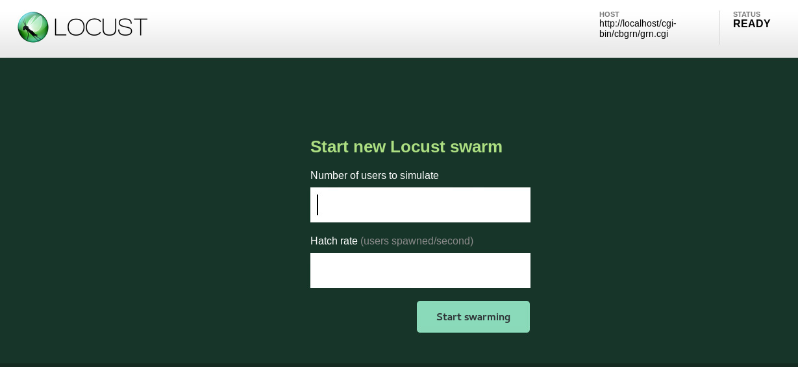
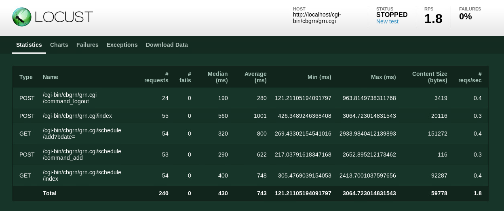
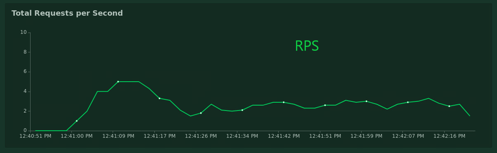
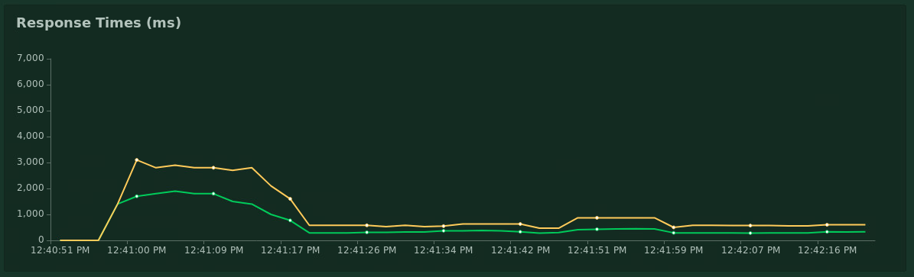
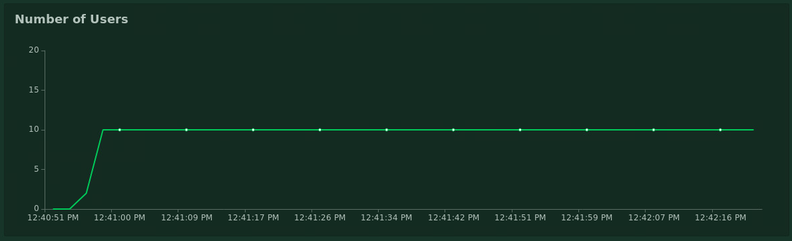

# Locust

## How to install the tool

1. installation
> python2.7:  
> python -m pip install locustio  
> python3:  
> python3 -m pip install locustio
2. Verify successful installation
> locust --help


## How to make the scenario
### Writing scripts manually
#### The Locust class  

+ A locust class represents one user (or a swarming locust if you will).   
Locust will spawn (hatch) one instance of the locust class for each user that is being simulated.   
There are a few attributes that a locust class should typically define.
```
class MyLocust(HttpLocust):
    task_set = MyTaskSet
    min_wait = 5000
    max_wait = 15000
    host = 'http://localhost/cgi-bin/cbgrn/grn.cgi'
```
+ The *task_set* attribute  
    The task_set attribute should point to a TaskSet class which defines the behaviour of the user.

+ The *min_wait* and *max_wait* attributes  
    In addition to the task_set attribute, one usually wants to declare the min_wait and max_wait attributes. 
    These are the minimum and maximum time respectively, in milliseconds, that a simulated user will wait between executing each task. 
    min_wait and max_wait default to 1000, and therefore a locust will always wait 1 second between each task if min_wait and max_wait are not declared.
    ex:
    With the above locustfile, each user would wait between 5 and 15 seconds between tasks

+ The *host* attribute  
    Http request's url

#### The TaskSet class

```
class MyTaskSet(TaskSet):
    
    @task(2)
    def on_start(self):
        ......

    @task(1)
    def task_logout(self):
        logout = {
            'logout':'Logout'
        }
        self.client.post("/command_logout")
```

If the Locust class represents a swarming locust, you could say that the TaskSet class represents the brain of the locust. 
Each Locust class must have a task_set attribute set, that points to a TaskSet.

+ the *@task* decorator  
    The typical way of declaring tasks for a TaskSet it to use the *task* decorator.
    @task takes an optional weight argument that can be used to specify the task’s execution ratio. In the above example *on_start* will be executed twice as much as *task_logout*.


## How to record the scenario(if the tool had this function)  
mitmproxy is researching:[https://github.com/zlorb/locust.replay](https://github.com/zlorb/locust.replay)


## The scenario of the test  
[https://github.dev.cybozu.co.jp/te/PerformanceToolResearch/blob/master/scripts/Locust/grn.py](https://github.dev.cybozu.co.jp/te/PerformanceToolResearch/blob/master/scripts/Locust/grn.py)


## How to run the scenario  

+ Locust has two ways to run.[No web] and [On web]  
  
the difference [No web] and [On web]:  
[No web] can set test times,[On web] can not,need to stop the test manually.  
[No web] no real-time charts,[On web] has real-time charts  

1. No web
```
# locust -f grn.py --logfile=grn.txt --no-web -c 10 -r 5 -t 1m -L DEBUG --csv=example --host=http://localhost/cgi-bin/cbgrn/grn.cgi 
```
Parameter Description  
```
--logfile:Path to log file. If not set, log will go to stdout/stderr
--no-web:no web,only command line
-c:Number of users to simulate
-r:Hatch rate(the speed at which the simulated user is generated)
-t:test times,1m=1minutes,60s=60seconds...
-L:loglevel,DEBUG/INFO/WARNING/ERROR/CRITICAL
--csv:--csv-base-name=CSVFILEBASE,Store current request stats to files in CSV format.
--host:Test request's url
```

2. On web
> Excute command
```
# locust -f grn.py --host=http://localhost/cgi-bin/cbgrn/grn.cgi
```
> Access *http://localhost:8089* in tool server,input parameter on web  

  

3. Click [Start swarming] button


## The result log of test  
+ requests
```
 Name                                                          # reqs      # fails     Avg     Min     Max  |  Median   req/s
--------------------------------------------------------------------------------------------------------------------------------------------
 POST /cgi-bin/cbgrn/grn.cgi/command_logout                        24     0(0.00%)     280     121     963  |     190    0.40
 POST /cgi-bin/cbgrn/grn.cgi/index                                 55     0(0.00%)    1001     426    3064  |     560    0.30
 GET /cgi-bin/cbgrn/grn.cgi/schedule/add?bdate=                    54     0(0.00%)     799     269    2933  |     320    0.40
 POST /cgi-bin/cbgrn/grn.cgi/schedule/command_add                  53     0(0.00%)     621     217    2652  |     290    0.30
 GET /cgi-bin/cbgrn/grn.cgi/schedule/index                         54     0(0.00%)     748     305    2413  |     400    0.40
--------------------------------------------------------------------------------------------------------------------------------------------
 Total                                                            240     0(0.00%)                                       1.80
```

+ distribution ※Percentage of the requests completed within given times
```
 Name                                                           # reqs    50%    66%    75%    80%    90%    95%    98%    99%   100%
--------------------------------------------------------------------------------------------------------------------------------------------
 POST /cgi-bin/cbgrn/grn.cgi/command_logout                         24    220    230    330    380    710    780    960    960    960
 POST /cgi-bin/cbgrn/grn.cgi/index                                  55    560    710   1400   2100   2500   2700   2800   3100   3100
 GET /cgi-bin/cbgrn/grn.cgi/schedule/add?bdate=                     54    340    560   1400   1600   2000   2500   2800   2900   2900
 POST /cgi-bin/cbgrn/grn.cgi/schedule/command_add                   53    290    460    840   1400   1500   1800   1800   2700   2700
 GET /cgi-bin/cbgrn/grn.cgi/schedule/index                          54    410    630   1200   1400   1800   2000   2200   2400   2400
--------------------------------------------------------------------------------------------------------------------------------------------
 Total                                                             240    430    580    970   1400   1900   2400   2700   2800   3100
```
+ charts  

①. Real-time statistics  

```
Type：request type
Name：request path
request：The number of current requests.
fails：The number of current failed requests.
Median：In milliseconds, half of the server response time is lower than this value, and the other half is higher than this value.
Average：In milliseconds, the average response time for all requests.
Min：The minimum server response time requested, in milliseconds.
Max：The maximum server response time requested, in milliseconds.
Content Size：The size of a single request, in bytes.
reqs/sec：The number of requests per second.
```  

  
  
②. Real-time RPS

  
  
③. Real-time response times
```
Green line：Median Response Time(ms)  
Time spent completing 50% of requests 

Orange line:95% percentile(ms)  
Time spent completing 95% of requests
```

  
  
④. Real-time number of users

  

## How long for write a script 
It takes more time to write a new script in the early stage.Can reuse the written request in the later stage.  
For example:
For the script I have written now,I spend 10 hours.
I am the basic level for python,need find a lot of information from the Internet.

## Does the script of Scalebench can be reused?  
Because they are related to Python, you can refer to ScaleBench's scripts.But languages are a little different and they have their own modules or classes,can not resue scripts completely.  

## Compare the tool with the Scalebench  
### Advantages
①. Have real-time charts  
②. Script's language Python is easier to write and read than Jython  
  
### Disadvantages
①. No convenient tool to recording  
②. No ramp-up peek value to set
